# Crow

<p align="center">
  
</p>

<p>
  <a href="LICENSE"></a>
  
  
  
  
  <a href="https://www.repostatus.org/#active"></a>
</p>

> An @enchanter-ai product — algorithm-driven, agent-managed, self-learning.

Real-time change comprehension. Bayesian trust scoring. Information-gain review.

**4 plugins. 6 algorithms. 4 agents. Every change accounted for.**

> Claude changed 12 files in 8 turns. I didn't read a single diff. Crow told me
> the auth migration was safe (trust: 0.82), the config change was not (trust: 0.31),
> and the test deletions were adversarial (trust: 0.18). I reviewed 2 files instead of 12.

## TL;DR

**In plain English:** Claude edited fourteen files this session. You'll skim three. Crow ranks the fourteen so the one that breaks production isn't the one you skipped.

**Technically:** V2 Beta-Bernoulli posterior scoring updates a per-file trust value on every Write/Edit, seeded at Beta(2,2) and pushed by change type. V3 Information-Gain ordering `IG = H(posterior)` surfaces maximum-uncertainty files first so the two files worth reviewing float to the top. Every advisory carries `(trust_score, change_type, N)` — no advisory ships without a posterior sample count.

## Origin

**Crow** takes its name from **Alex's Mobs** — a sharp-eyed corvid that perches over disturbances, inspects every object it finds, remembers faces, and sorts friend from threat. Every AI-assisted edit is a disturbance until its diff has been read; Crow reads it for you and scores trust before it reaches main.

The question this plugin answers: *What just happened?*

## Who this is for

- Reviewers drowning in AI-generated diffs who want `review the 2 risky files, not all 12`.
- Teams who've been burned by silent destructive edits mid-session and want a scored, auditable trail.
- Engineers who understand that *trust is evidence, not vibes* and want the Bayesian posterior to say so.

Not for:

- Solo hack sessions where every edit is intentional and review friction is pure cost.
- Teams that want a blocking gate — Crow is advisory by design (see [shared/foundations/conduct/hooks.md](shared/foundations/conduct/hooks.md) § Injection over denial).

## Contents

- [The Problem](#the-problem)
- [How It Works](#how-it-works)
- [What Makes Crow Different](#what-makes-crow-different)
- [The Full Lifecycle](#the-full-lifecycle)
- [Install](#install)
- [Quickstart](#quickstart)
- [4 Plugins, 4 Agents, 6 Algorithms](#4-plugins-4-agents-6-algorithms)
- [What You Get Per Session](#what-you-get-per-session)
- [Roadmap](#roadmap)
- [The Science Behind Crow](#the-science-behind-crow)
- [Commands](#commands)
- [How Trust Scoring Works](#how-trust-scoring-works)
- [How Information-Gain Ordering Works](#how-information-gain-ordering-works)
- [vs Everything Else](#vs-everything-else)
- [Agent Conduct (11 Modules)](#agent-conduct-11-modules)
- [Architecture](#architecture)
- [Acknowledgments](#acknowledgments)
- [Versioning & release cadence](#versioning--release-cadence)
- [Contributing](#contributing)
- [Citation](#citation)
- [License](#license)

## The Problem

The review-and-comprehension loop eats 40-60% of every Claude Code session:
- Developers rubber-stamp 93% of permission prompts (Anthropic data)
- Developers start second Claude instances to review the first (Issue #1144)
- The diff UI shows +7,490/-6,880 for an 11-line change (Issue #18541)
- No per-hunk accept/discard exists (Issue #31395)
- 10-20% of sessions are abandoned due to unexpected changes

## How It Works

Four plugins, one concern each, bound to specific hook points. **decision-gate** on `PreToolUse` orders pending reviews by information gain (H3) and red-teams low-trust changes (H5). **change-tracker** on `PostToolUse` classifies and clusters every diff (H1). **trust-scorer** on `PostToolUse` updates a Beta-Bernoulli posterior per file (H2). **session-memory** on `PreCompact` builds a continuity graph and persists cross-session learnings (H4, H6). The diagram below shows the bindings and state outputs.

<p align="center">
  <a href="docs/assets/pipeline.mmd" title="View hook-binding diagram source (Mermaid)">
    
  </a>
</p>

<sub align="center">

Source: [docs/assets/pipeline.mmd](docs/assets/pipeline.mmd) · Regeneration command in [docs/assets/README.md](docs/assets/README.md).

</sub>

Each plugin owns one concern. No overlap. No dependencies between plugins.

## What Makes Crow Different

### It scores trust instead of flagging changes

Every Write/Edit updates a Beta-Bernoulli posterior per file. Docs push the mean up, sensitive config pushes it down, reverts halve the likelihood. After 6 changes, a file's trust posterior has narrowed enough to say "review this one" or "this one's fine" — no more rubber-stamping 12 diffs at equal weight.

### It orders reviews by Information Gain, not diff position

`IG(X) = H(trust posterior)`. Changes at trust 0.5 get reviewed first (maximum uncertainty, maximum value). Changes at trust 0.1 or 0.9 drop to the bottom — the decision is already made. You review 2 files out of 12, and they're the right 2.

### Adversarial questions, not generic warnings

For any file under trust 0.4, the decision-gate agent generates specific adversarial questions tied to the diff content. "This changes the database query from parameterized to string interpolation — SQL injection risk." Not "consider security implications."

### It remembers your review patterns across sessions

H6 Exponential Strategy Averaging (cross-session EMA) adapts priors per file type. After N sessions, Crow knows: config changes always get flagged by this developer, test changes are usually safe, schema changes require careful review. The classifier's defaults give way to what you actually do.

## The Full Lifecycle

The tool executes, then `PostToolUse` runs decision-gate (H3 IG-ranking + H5 adversarial questions on fresh trust scores), change-tracker, and trust-scorer. When context fills, `PreCompact` triggers session-memory to write `session-graph.json` before the wipe. On resume, the restorer agent reads it back autonomously.

<p align="center">
  <a href="docs/assets/lifecycle.mmd" title="View session-lifecycle diagram source (Mermaid)">
    
  </a>
</p>

<sub align="center">

Source: [docs/assets/lifecycle.mmd](docs/assets/lifecycle.mmd) · Regeneration command in [docs/assets/README.md](docs/assets/README.md).

</sub>

## Install

Crow ships as 4 plugins that feed each other (change-tracker → trust-scorer → decision-gate → session-memory). One meta-plugin — `full` — lists all four as dependencies, so a single install pulls in the whole chain.

**In Claude Code** (recommended):

```
/plugin marketplace add enchanter-ai/crow
/plugin install full@crow
```

Claude Code resolves the dependency list and installs all 4 plugins. Verify with `/plugin list`.

**Want to cherry-pick?** Individual plugins are still installable by name — e.g. `/plugin install crow-trust-scorer@crow` if you only need scoring. The pipeline is designed to work end-to-end, though, so `full@crow` is the path we recommend.

**Via shell** (also installs `shared/*.sh` and `shared/scripts/*.py` locally so hooks work offline):

```bash
bash <(curl -s https://raw.githubusercontent.com/enchanter-ai/crow/main/install.sh)
```

## Quickstart

Install, let Claude edit something, read the trust score. Sixty seconds:

```
/plugin install full@crow
# ...let Claude make any Write / Edit...
/crow:trust
```

Expected: `/crow:trust` prints per-file rows sorted riskiest-first — trust score, band (HIGH / MEDIUM / LOW), and the specific engine signals (H1 semantic delta, H2 Bayesian posterior, H3 info-gain, H4 continuity) driving the verdict. See [docs/getting-started.md](docs/getting-started.md) for the full guided first run and [THREAT_MODEL.md](THREAT_MODEL.md) for the attacker-input model Crow is hardened against.

## 4 Plugins, 4 Agents, 6 Algorithms

| Plugin | Hook | Command | What |
|--------|------|---------|------|
| change-tracker | PostToolUse | `/crow:changes` | Semantic diff compression + classification |
| trust-scorer | PostToolUse | `/crow:trust` | Bayesian trust scoring + alerts |
| decision-gate | PostToolUse | `/crow:review` | IG-ordered review + adversarial questions |
| session-memory | PreCompact | `/crow:session` | Continuity graph + Exponential Strategy Averaging |

| Agent | Model | Plugin | What |
|-------|-------|--------|------|
| classifier | Haiku | change-tracker | Deep semantic change classification |
| auditor | Haiku | trust-scorer | Trust distribution analysis + risk report |
| adversary | Sonnet | decision-gate | Targeted adversarial review questions |
| restorer | Haiku | session-memory | Autonomous context restoration |

## What You Get Per Session

Three hook events fan out into four color-coded journals — one per sub-plugin — and converge on the enchanted-mcp bus and the `/crow:*` query surface. Color maps engines to journals: blue = change-tracker (V1 semantic-diff) · purple = trust-scorer (V2 Bayesian + V6 Exponential Strategy Averaging) · red = decision-gate (V3 info-gain) · yellow = session-memory (V4 continuity graph).

<p align="center">
  <a href="docs/assets/state-flow.mmd" title="View state-flow diagram source (Mermaid)">
    
  </a>
</p>

<sub align="center">

Source: [docs/assets/state-flow.mmd](docs/assets/state-flow.mmd) · Regeneration command in [docs/assets/README.md](docs/assets/README.md).

</sub>

```
change-tracker/state/
├── changes.jsonl        # Every file change with type, hash, cluster
└── metrics.jsonl        # change_tracked events

trust-scorer/state/
├── trust.json           # Per-file Beta parameters and trust scores
├── learnings.json       # Cross-session Exponential Strategy Averaging data
└── metrics.jsonl        # trust_scored events

decision-gate/state/
└── metrics.jsonl        # review_advisory events

session-memory/state/
├── session-graph.json   # Continuity graph (nodes, edges, trust overview)
├── session-summary.md   # Human-readable session recap
└── metrics.jsonl        # session_saved events
```

## Roadmap

Tracked in [docs/ROADMAP.md](docs/ROADMAP.md) and the shared [ecosystem map](docs/ecosystem.md). For upcoming work specific to Crow, see issues tagged [roadmap](https://github.com/enchanter-ai/crow/labels/roadmap).

## The Science Behind Crow

Six named algorithms power every decision:

### H1. Semantic Diff Compression (Change Tracker)

Raw diffs are noise. Crow classifies each change by type and clusters related changes across files.

Change types: `source_code`, `config_change`, `test_change`, `documentation`, `schema_change`, `dependency_change`.
Impact radius: local (1 file), module (2-5 files), systemic (6+ files).

<p align="center"></p>

### H2. Bayesian Trust Scoring (Trust Scorer)

Each file change gets a trust score using Beta-Bernoulli conjugate priors.

<p align="center"></p>

<p align="center"></p>

Prior: Beta(2, 2) — mildly uncertain. Update via change-type likelihood ℓ. Trust reported as the posterior mean.

| Change Type | Likelihood ℓ |
|-------------|------------------|
| Documentation | 0.95 |
| Test changes | 0.85 |
| Source code (small) | 0.70 |
| Source code (large) | 0.50 |
| Schema changes | 0.55 |
| Dependencies | 0.50 |
| Config (sensitive) | 0.30 |

### H3. Information-Gain Decision Support (Decision Gate)

Help the developer review efficiently by showing the most uncertain changes first.

<p align="center"></p>

Maximum at p = 0.5 (trust is most uncertain). Changes at trust 0.5 get reviewed first. Changes at trust 0.1 or 0.9 are already decided — low review value.

### H4. Session Continuity Graph (Session Memory)

Before compaction, build a semantic graph:
- Nodes: files (with type, trust, change count), decisions (review advisories)
- Edges: cluster relationships, file-to-decision links

On resumption: "Last session: 15 changes, 2 low-trust files flagged, 3 advisories issued."

### H5. Adversarial Self-Review (Decision Gate extension)

For low-trust changes (trust < 0.4), generate specific adversarial questions:
- "This changes the database query from parameterized to string interpolation. SQL injection risk."
- "This test now asserts `true === true`. The original checked actual business logic."
- "This deletes the rate limiter. Was rate limiting intentional?"

Not generic warnings. Specific to the diff content.

### H6. Exponential Strategy Averaging (Cross-Session)

Exponential moving average over per-type trust rates across sessions.

<p align="center"></p>

After N sessions, Crow knows: config changes always get flagged, test changes are usually safe,
this developer always reviews schema changes carefully. Adapts priors accordingly.

## Commands

| Command | Plugin | What |
|---------|--------|------|
| `/crow:changes` | change-tracker | All changes grouped by type and file |
| `/crow:trust` | trust-scorer | Trust scores sorted riskiest-first |
| `/crow:review` | decision-gate | IG-ranked review queue with adversarial questions |
| `/crow:session` | session-memory | Full session dashboard |

## How Trust Scoring Works

1. Every file starts at Beta(2, 2) — a mildly uncertain prior (mean = 0.5).
2. Each Write/Edit updates the posterior: high-trust types (docs, tests) push the score up, risky types (config, schema) push it down.
3. After multiple updates, the posterior narrows — confidence increases.
4. Reverts are penalized: if a file returns to a previous hash, the likelihood is halved.
5. Trust scores persist across the session via `trust.json`. Cross-session learning via `learnings.json`.

## How Information-Gain Ordering Works

Not all files are equally worth reviewing. Crow ranks by uncertainty:
- Trust 0.5 → IG 1.0 (maximum uncertainty — you need to look at this)
- Trust 0.1 → IG 0.47 (clearly bad — you already know)
- Trust 0.9 → IG 0.47 (clearly good — don't waste time)

Review the uncertain files first. Skip the ones where trust is already decided.

## vs Everything Else

| | Crow | Gryph | Context Mode | ClaudeWatch | Anthropic Review |
|---|---|---|---|---|---|
| Real-time awareness | in-session | post-hoc | — | — | post-PR |
| Trust scoring | Bayesian | — | — | — | — |
| Per-change review | IG-ordered | — | — | — | — |
| Adversarial questions | specific | — | — | — | generic |
| Session continuity | graph + learnings | — | — | — | — |
| Cross-session learning | Gauss EMA | — | — | — | — |
| Dependencies | bash + jq | Node | Node + MCP | Python | API |

## Agent Conduct (11 Modules)

Every skill inherits a reusable behavioral contract from [shared/](shared/) — loaded once into [CLAUDE.md](CLAUDE.md), applied across all plugins. This is how Claude *acts* inside Crow: deterministic, surgical, verifiable. Not a suggestion; a contract.

| Module | What it governs |
|--------|-----------------|
| [discipline.md](shared/foundations/conduct/discipline.md) | Coding conduct: think-first, simplicity, surgical edits, goal-driven loops |
| [context.md](shared/foundations/conduct/context.md) | Attention-budget hygiene, U-curve placement, checkpoint protocol |
| [verification.md](shared/foundations/conduct/verification.md) | Independent checks, baseline snapshots, dry-run for destructive ops |
| [delegation.md](shared/foundations/conduct/delegation.md) | Subagent contracts, tool whitelisting, parallel vs. serial rules |
| [failure-modes.md](shared/foundations/conduct/failure-modes.md) | 14-code taxonomy for accumulated-learning logs |
| [tool-use.md](shared/foundations/conduct/tool-use.md) | Tool-choice hygiene, error payload contract, parallel-dispatch rules |
| [skill-authoring.md](shared/foundations/conduct/skill-authoring.md) | SKILL.md frontmatter discipline, discovery test |
| [hooks.md](shared/foundations/conduct/hooks.md) | Advisory-only hooks, injection over denial, fail-open |
| [precedent.md](shared/foundations/conduct/precedent.md) | Log self-observed failures to `state/precedent-log.md`; consult before risky steps |
| [tier-sizing.md](shared/foundations/conduct/tier-sizing.md) | Prompt verbosity scales inversely with model tier; Haiku needs mechanical steps, Opus runs on intent |
| [web-fetch.md](shared/foundations/conduct/web-fetch.md) | External URL handling: cache, dedup, budget; WebFetch is Haiku-tier-only |

## Architecture

Interactive architecture explorer with plugin diagrams, agent cards, and data flow:

**[docs/architecture/](docs/architecture/)** — auto-generated from the codebase. Run `python docs/architecture/generate.py` to regenerate.

## Acknowledgments

Crow builds on foundations laid by others:

- **[Claude Code](https://github.com/anthropics/claude-code)** (Anthropic) — the plugin surface this work extends.
- **[Keep a Changelog](https://keepachangelog.com/)** — CHANGELOG convention.
- **[Semantic Versioning](https://semver.org/)** — versioning contract.
- **[Contributor Covenant](https://www.contributor-covenant.org/)** — Code of Conduct.
- **[repostatus.org](https://www.repostatus.org/)** — status badge.
- **[Citation File Format](https://citation-file-format.github.io/)** — citation metadata.
- **[Conventional Commits](https://www.conventionalcommits.org/)** — commit convention.

## Versioning & release cadence

Crow follows [Semantic Versioning](https://semver.org/spec/v2.0.0.html). Breaking changes land on major bumps only; the [CHANGELOG](CHANGELOG.md) flags them explicitly. Release cadence is opportunistic — tags land when accumulated fixes or features justify a cut, not on a fixed schedule. Migration notes between majors live in [docs/upgrading.md](docs/upgrading.md).

## Contributing

See [CONTRIBUTING.md](CONTRIBUTING.md)

## Citation

If you use this project in research or derivative work, please cite it:

```bibtex
@software{crow_2026,
  title = {Crow},
  author = {{Klaiderman}},
  year = {2026},
  url = {https://github.com/enchanter-ai/crow}
}
```

See [CITATION.cff](CITATION.cff) for additional formats (APA, MLA, EndNote).

## License

MIT

---

## Role in the ecosystem

Crow is the **change-trust layer** — it scores every Write/Edit the agent makes before the change influences a commit. Upstream, Wixie's prompts produce the changes Crow observes. Downstream, Sylph consumes Crow's trust signal in its W4 reviewer routing (blame × recency × CODEOWNERS × **Crow availability**), and Lich uses Crow's trust as a gating prior before spending sandbox time on deep review.

Crow does not engineer prompts (Wixie's lane), track tokens (Emu's lane), review code correctness (Lich's lane), orchestrate PR lifecycle (Sylph's lane), or scan security surfaces (Hydra's lane). It scores trust in what just happened.

See [docs/ecosystem.md § Data Flow Between Plugins](docs/ecosystem.md#data-flow-between-plugins) for the full map.
